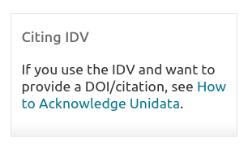

+++
chapter = true
title = "Unidata IDV"
weight = 40
+++

# Unidata IDV

The Unidata Integrated Data Viewer (IDV) [DOI: 10.5065/D6RN35XM](https://doi.org/10.5065/D6RN35XM) includes a clear visual cue and instruction from the software's [primary landing page](https://www.unidata.ucar.edu/software/idv/):

 

From which a simple citation recommendation example is included, that also provides information about the cited version of the software, which points to the current IDV software version.

>  Unidata, (2012): Integrated Data Viewer (IDV) version 3.1 [software]. Boulder, CO: UCAR/Unidata. ( http://doi.org/10.5065/D6RN35XM) 